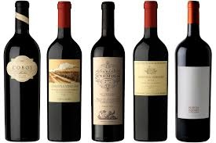

# Nombre de la Aplicación:
    Trabajo Práctico Nro 1 - Supermercado Los Lev

# Developer: 
    Antonio Gennaro
    

# Tipo de productos:
    Se eligió la Sección Vinos del Supermercado Los Levs
    

# Experiencia en el Desarrollo
El maquetado me llevó mucho trabajo hasta que logré el comportamamiento que buscaba.
Tuve que completar la versión estática en HTML para poder ver el comportamiento con los 10 productos cargados.
Aun me cuesta hacer que cada uno de los bloques o contenedores se comporten como se debe y que los elementos 
que contienen se acomoden en la misma linea o unos arriba del otro.
# Cómo se solucionó:
Investigando un poco en internet y probando logre el comportmiento buscado.

# Cómo solucionan los errores que presentaban a lo largo del desarrollo
Mucha prueba y error y consulta de aplicaciones anteriuoires e internet.

# Qué es lo más importante que aprendieron con este proyecto:
Principalmenete el tema del Maquetado en esta aplicación hubo que utilizar muchso recursos. 

# Versiones subidas
Para la v2, agregué la parte de selección de cantidades y colores, definí algunos vectores como los de imagenes y colores.
En la v3 se completo el algoritmo, se probó y aparentmente funciona bien.
Para la v4 falta optimizar el código compactar y agregar comentarios.
V4: Se mejora el maquetado y el código con el uso de funciones, se agregan comentarios y alguno sdetalles de estética y funcionalidad.
V5: Se sigue revisando y agregando correcciones.

# Posible funcionalidad que les gustaría agregar:
Agregué algunas funcionalidades como cambiar textos y colores no pedidos y la indicación del producto comprado con un método para identificar los producots que se deberáin agregar en el carrito.
En cuanto a las funcionalidades que se podrían agregar en una segunda parte, podría ser emitir el total de la compra acumulada en le carrito. Por ejemplo cuando se muestran 3, 7 o 10 productos permitir que se compre hasta la cantidad indicada en cada caso pero de si se lo desea todos los producots mostrados.  
# V6
V6: Para la V6 se mejoró el estilo y el comportamiento respecto del zoom y la modificación del tamaño d ela ventana, logrando un vista proporcional en todo momento.
Tambie´n se agregaron fondos de pantalla y mejoras en la estética en general, los colores de fondo y los textos. 
Además se agregaron funcionalidades a los botones de COMPRAR de manera de mostrar el precio total de la compra de cada uno de los artículos en función del precio unitario informado y la cantidad seleccionada. 